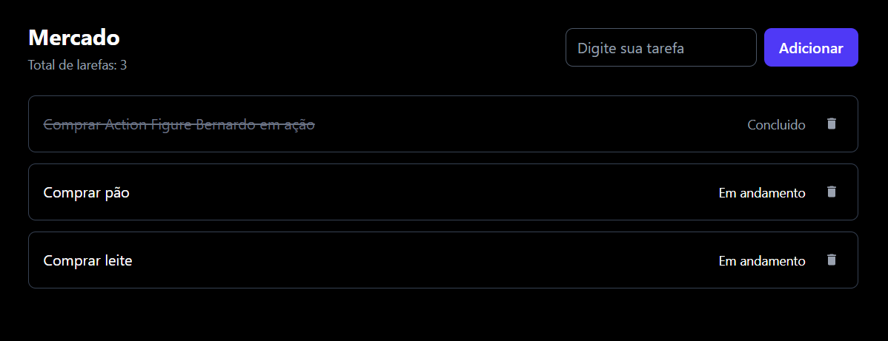

# Task Hub


##  📅 Sobre o projeto:
TaskHUB é uma aplicação de gerenciamento de tarefas que foi criada como projeto pessoal para desenvolvimento 
e aprendizagem de ferramentas únicas como Electron, React, NodeJS, Express, PrismaDB, SQLlite e entre outras.

````
#Instalar dependencias
npm install

# Iniciar back
npm start

# Iniciar front
npm run dev
````


<br>
<br>
<br>
<br>

### ✏️ Exemplo:
---
</img>
</img>
