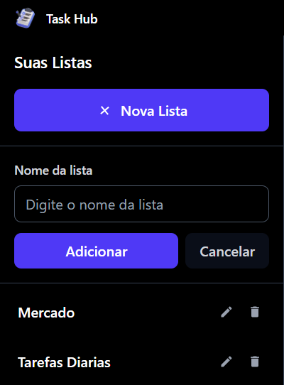

<div align="center">
 
</div>

<div align="center">
 <br \>
 <br \>
 <br \>
 </img>
 <h3><strong>TASK HUB</strong></h3>
 <p>Uma aplicação moderna de gerenciamento de tarefas feita em Electron</p>
</div>

---

## Sobre o Projeto

**TaskHub** é uma aplicação desktop de gerenciamento de tarefas desenvolvida como projeto pessoal para aprendizado e prática de tecnologias modernas. 

### Principais Funcionalidades

- ➤ **Criação de Listas** - Organize suas tarefas em listas.
- ➤ **Gerenciamento de Tarefas** - Adicione, remova e marque como concluida.
- ➤ **Interface Moderna** - Design limpo e intuitivo
- ➤ **Sistema de Autenticação** - Login seguro com JWT e Bcrypt
- ➤ **Salvamento de Dados** - Seus dados salvos localmente pelo SQLlite
- ➤ **Aplicação Desktop** - Funciona offline sem depender do navegador (Necessário estar rodando em background)

---

## Ferramentas utilizadas

<div align="center">
 
### ▼ Frontend


### ▼ Backend


### ▼ Database & Desktop


### ▼ Autenticação & Segurança


</div>

---

## Instalação e Execução

### ➤ Execucação
```bash
# Para a instalação do executavel acesse
https://github.com/whoisleoo/Electron-Todo-List/releases/tag/todo

# Instale o instalador mais recente
Task.Hub-1.2.0-x64.exe


````
### ⚠️ Em caso de detectação conta virus e ameaça desligue seu anti-virus
  ● Esse erro vai ser arrumado em breve, caso não confie no executavel sugiro que acesse via <a href="https://bmzmarketing.shop">WEB</a>
  ● Além disso, caso queira saber mais sobre esse aviso, consulte esse <a href="https://github.com/whoisleoo/Electron-Todo-List/issues/2">issue</a>


### ➤ Instalação Manual

```bash
# Clone o repositório
git clone https://github.com/seu-usuario/taskhub.git

# Entre no diretório frontend
cd frontend

# Instale as dependências
npm install

# Entre no diretório backend
cd frontend

# Instale as dependências
npm install

# Configure o banco de dados no diretorio backend
npx prisma generate
npx prisma migrate dev

# Configure o .env
DATABASE_URL="file:./src/database/dev.db"
JWT_SECRET=""

# Inicie o frontend na pasta frontend
npm run dev

# Inicie o backend na pasta backend
npm start

# Para executar o painel do banco de dados
npx prisma studio
````

---

## Pré-visualização do aplicativo

### Exemplos:
<div align="center">
</img>
</img>
</img>
</div>
